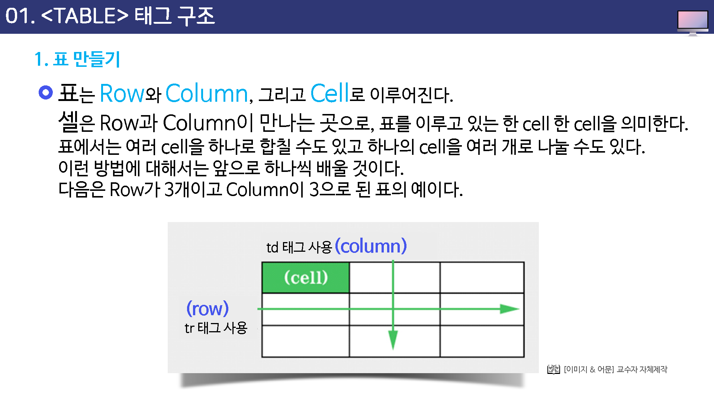
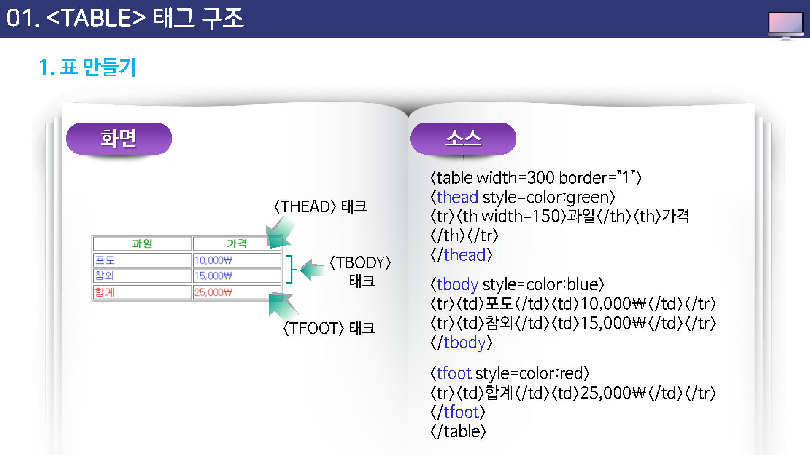

# 테이블 테그
테이블 테그를 이용하여 그리드 데이터를 표현할 수 있습니다.

## table 테그
html에서 표를 생성하는 테그 입니다.  
테이블은 외각은 `table`테그를 사용합니다.

```html
<table>
</table>
```
위의 예제는 비어있는 테이블 입니다.  

`table` 테그는 기본적으로 2개의 테그를 포함합니다. `tr`테그는 가로줄을 의미하며
`td`테그는 셀을 의미합니다.

### tr
`tr`테그는 테이블에서 한줄을 의미 합니다.  

```html
<table>
    <tr></tr>
    <tr></tr>
</table>
```

위의 예제는 테이블은 2개의 줄을 포함합니다.  

### td
`td`테그는 테이블 한줄에 있는 셀 데이터를 의미합니다.

```html
<table>
    <tr>
        <td>내용1</td>
        <td>내용2</td>
        <td>내용3</td>
    </tr>
    <tr>
        <td>내용4</td>
        <td>내용5</td>
        <td>내용6</td>
    </tr>
</table>
```

`열` 과 `행`을 포함하는 데이터 테이블이 생성이 되었습니다.

## 데이터 영역
html5는 테이블 영역을 꾸밀수 있는 몇개의 테그들이 추가 되었습니다. 
실제 적인 데이터의 본체를 구별하기 위해서 `tbody` 테그를 추가합니다.

```html
<table>
    <tbody>
    <tr>
        <td>내용1</td>
        <td>내용2</td>
        <td>내용3</td>
    </tr>
    <tr>
        <td>내용4</td>
        <td>내용5</td>
        <td>내용6</td>
    </tr>
    </tbody>
</table>
```

## 상단영역
보통 테이블의 첫번째 줄은 각 셀의 의미를 담고 있는 제목으로 사용 되는 경우가 많습니다.
html5에서는 테이블 내부의 영역을 구분하여 제목행을 구별할 수 있는 `thead`테그를 지원합니다.

```html
<table>
    <thead>
    <tr>
        <td>제목1</td>
        <td>제목2</td>
        <td>제목3</td>
    </tr>
    </thead>
    <tbody>
    <tr>
        <td>내용1</td>
        <td>내용2</td>
        <td>내용3</td>
    </tr>
    <tr>
        <td>내용4</td>
        <td>내용5</td>
        <td>내용6</td>
    </tr>
    </tbody>
</table>
```

## 하단설정
html5는 테이블의 하단 영역을 추가할 수 있습니다. 
`tfoot`테그를 사용합니다.

```html
<table>
    <thead>
    <tr>
        <td>제목1</td>
        <td>제목2</td>
        <td>제목3</td>
    </tr>
    </thead>
    <tbody>
    <tr>
        <td>내용1</td>
        <td>내용2</td>
        <td>내용3</td>
    </tr>
    <tr>
        <td>내용4</td>
        <td>내용5</td>
        <td>내용6</td>
    </tr>
    </tbody>
    <tfoot>
    <tr>
        <td>하단1</td>
        <td>하단2</td>
        <td>하단3</td>
    </tr>
    </tfoot>
</table>
```

## 제목
html5의 테이블은 제목을 별도의 테그로 설정을 할 수 있습니다.
`caption`테그를 삽입합니다.

```html
<table>
    <caption>제목입니다.</caption>
    
    <thead>
    중간생략...
    </thead>
    <tbody>
    중간생략...
    </tbody>
    <tfoot>
    중간생략...
    </tfoot>
</table>
```

`caption`테그는 테이블 테그안에, 상단에 작성을 합니다.


### caption 테그
caption은 표의 제목에 해당하며, table 테그 다음에 위치를 합니다.

켑션의 특징은 `가운데 정렬`로 표시 됩니다.


### 열(cols)
위에서 아래로 

* colgroup :
* col :

```html
<table>
    <colgroup>
        <col width="25%">
        <col width="25%">
        <col width="25%">
        <col width="25%">
    </colgroup>
</table>
```

테이블 한줄에 들어가는 열의 갯수만큼 col을 지정합니다.


### 행(rows)
가로줄을 말합니다.


### 머리말
thead

특징 : 가운데 정렬, 굵은 글씨로 표시됩니다.

제목셀인 `th`로 사용을 합니다. th는 tbody, tfoot에서도 사용이 가능합니다.

```html
<thead>
    <tr>
        <th>제목1</th>
        <th>제목2</th>
        <th>제목3</th>
        <th>제목4</th>
    </tr>
</thead>
```

### 본문
tbody


```html
<tbody>
    <tr>
        <td>내용1</td>
        <td>내용2</td>
        <td>내용3</td>
        <td>내용4</td>
    </tr>
</tbody>
```


### 하단
tfoot


```html
<tfoot>
    <tr>
        <td>내용1</td>
        <td>내용2</td>
        <td>내용3</td>
        <td>내용4</td>
    </tr>
</tfoot>
```

굵은 글자로 표시하고자 할때에는 td 대신에 th로도 사용할 수도 있습니다.

```html
<tfoot>
    <tr>
        <th>합계</th>
        <td>-</td>
        <td>-</td>
        <td>5050</td>
    </tr>
</tfoot>
```

### 셀 합치기

```html
<table>
    <tr>
        <tr>셀1</td>
        <tr>셀2</td>
        <tr>셀3</td>
        <tr>셀4</td>
    <tr>
    <tr>
        <tr>셀5</td>
        <tr>셀6</td>
        <tr>셀7</td>
        <tr>셀8</td>
    <tr>
    <tr>
        <tr>셀9</td>
        <tr>셀10</td>
        <tr>셀11</td>
        <tr>셀12</td>
    <tr>
</table>
```


## 학습목표
---
* table 태그 구조에 대해 살펴볼 수 있다.
* table 태그의 속성들을 살펴볼 수 있다.
* th,tr,td 태그에 대해 살펴볼 수 있다.
* 테이블의 셀 병합하는 방법을 익힐 수 있다.

## 기본 테그

### 테이블 태그 기본
표를 만들 때는 table 태그를 시용 합니다. 
* table
* tr : 표 내부의 행 태그
* td : 행 내부의 제목 셀 태그
* th : 행 내부의 일반 셀 태그

### 표 영역 요소
* thead
* tbody
* tfoot
* caption

### 행, 열 합치기
* colspan
* rowspan
* col
* colgroup

## 테이블 속성
예전에는 table 태그는속성이 굉장히 많았습니다. 하지만, HTML5에서는 속성에서 처리하는 설정값을 CSS3로 대체가 되고 있습니다.

* border
* rowspan : 셀의 높이 지정
* colspan : 셀의 너비 지정


# 테이블 태그와 함께 사용하는 태그들


## 테이블 관련 태그들

앞에서 설명한 형식처럼 table 태그와 /table 태그 사이에는 tr 이나 td 같은 다른 태그들을 사용해서 셀을 만들게 된다.

table 태그와 /table 태그 사이에서 사용할 수 있는 태그는 다음과 같다.


* cation : 표에 대한 제목이나 간단한 설명을 삽입, 표의 위쪽 가운데에 표시된다.
* th : 표의 한 칸을 지정하느데, 이 칸 안의 내용들은 제목으로 설정되어 진하게 표시된다.
* tr:표의 한줄을 지정한다.
* td: 표의 한 칸을 지정한다.


앞의 소스에서 보는 것처럼, 아무것도 들어기지 않는 빈 셀은 width 속성으로 크기를 지정해 주는 좋이 좋다

```
<td width="200"> &nbsp; </td>
```

 그리고 공백 문자를 나타내는 `&nbsp;`를 써준다.


# 테이블 태그 구조


## 표 만들기

표는 row와 column, 그리고 cell로 이루어진다.

셀은 row과 column이 만나는 곳으로, 표를 이루고 있는 한 cell 한 cell을 의미한다.

표에서는 여러 cell을 하나로 합칠 수도 있고, 하나의 cell을 여러 개로 나눌 수도 있다.

이런 방법에 대해서는 앞으로 하나씩 배울 것이다. 다음은 row가 3개이고 column이 3으로 된 표의 예이다.




## 표 만들기

표를 만들때는 table 태그와 함께 tr 태그와 td 태그를 같이 사용해야 한다.

tr 태그는 row를 만드는 태그이고, td 태그는 cell을 만드는 태그인데 tr 태그와 td 태그가 만나서 하나의 셀을 이루게 된다.


표는 cell들을 여러개 모아 놓은 것인데 이렇게 cell을 만들 때는 tr 태그를 먼저 사용해서 줄을 하나 만든 다음,  그 안에 td 태그를 사용하여 원하는 만큼 cell을 만들면 된다.

즉, 다은 소스에서 보는 것처럼 tr 태그안에 td 태그를 넣어 셀을 하나로 만드는 것이다.


조금 전에 보았던 소스에서 보는 것처럼 tr 태그를 한번 사용하고 나서 td 태그를 사용하면 하나의 셀이 만들어 진다.


## 태그 구조


### thead 태그 : 그룹 테이블 해더 태그(table header)

`<thead>` 태그는 HTML테이블에서 각각의 셀 들에 있는 머리글 내용을 묶는데 사용 되어진다.

이 태그는 주로 테이블의 `<body>`,`<footer>`를 지정해주는 `<tody>` 태그와 `<tfoot>` 태그를 함께 결합하여 사용한다.


### TBody 태그 : 테이블 바디 태그 (table body)

tbody 태그는 HTML 테이블에서 본문 부분에 있는 내용을 묶는데 사용되어진다.


### TFoot 태그

tfoot 태그는 HTML 테이블에서 꼬리 부분에 있는 애용을 묶는데 사용되어진다.





# th
`th` 태그는 table header를 의미

# td
td 태그는 table data를 의미합니다.


# th,tr,td 태그와 관련된 속성들


앞에서 table 태그에 대한 속성들을 살펴보았다.

이 속성들은 표 전체에 적용하는 곳성이 있었다. 이번에는 한 줄 전체)tr)나 각 셀(td) 또는 TH에 적용하는 속성들을 보펴 보겠다.


