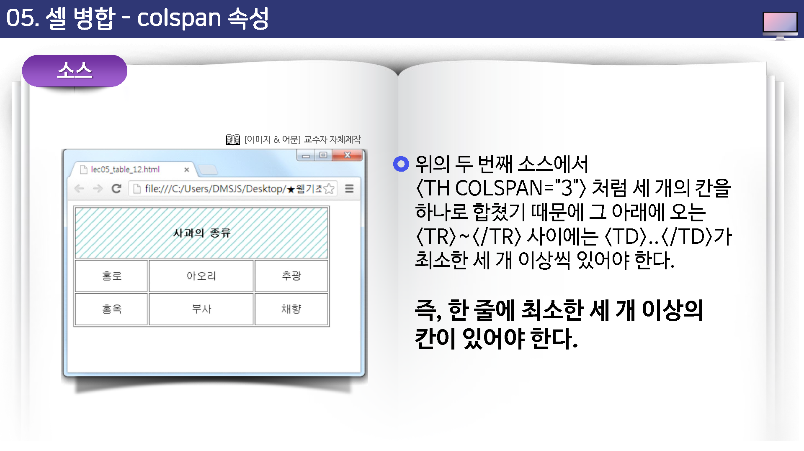

# 셀 병합

표는 tr 태그와 td태그 등을 이용해서 여러 개의 셀로 구성할 수 있다.

그리고 셀들은 합칠 수도 있기 때문에 이렇게 만들어진 셀 안에 또 다른 표를 삽입하면서 여러 가지 형태의 표를 한들 수도 있다.

여러 칸을 합쳐서 하나의 칸으로 만들 수도 있고, 여러 줄을 합쳐서 하나의 줄로 만들 수도 있다.


칸을 만들 때 사용하는 태그는 th태가나 td태그인데 여러 같을 합치기 위해서는 th태그나 td 태그안에서 colspan 속성을 사용한다.

기본 형식은 다음과 같다.


```html
<th colspan="합칠칸수">...</th>
<td colspan="합칠칸수">...</td>
```

셀들은 바로 옆에 인접한 셀들끼리만 합칠 수 있다.

그리고 셀을 합칠 경우에는 머저 종이에 펜으로 직접 표를 그려보고 어느 부분을 어떻게 할칠 것인지 미리 확인해야 한다.


3*3 표(간 4개, 줄 3개인 표)에서 첫 번째 줄에 있는 세 개의 셀을 합쳐서 하나의 칸으로 만들 것이고, 합치려는 칸에 제목이 들어갈 거라면 다름과 같은 태그를 사용한다.


```
<th colspan="3">...</th>
```


그리고 명심할 것은 첫 번째 줄에서 colspan 속성을 사용해서 세 칸을 합쳤기 때문에 나머지 줄들 (<tr>...</tr>)에서는 셀을 만드는 td 태그나  th 태그가 최소한 세 개가 와야 한다는 것이다.

즉, 어떤 줄에서 칸을 합했으면 다른 줄에는 최소한 합한 칸의 수만큼의 칸이 있어야 한다.





## colgroup
컬럼열의 그룹을 설정할 수 있습니다.


## 합치기
작성된 표의 일부분을 합치는 기능을 제공합니다.

### colspan
가로로 걸치는 셀의 갯수
`colspan` 셀의 너비를 지정합니다.

### rowspan
세로로 걸치는 셀의 갯수
`rowspan` 셀의 높이를 지정합니다.


#### 열 합치기 (colspan)
열이 합쳐 질때는 `오른쪽`에서 `왼쪽`으로 합쳐지게 됩니다.
합쳐지는 열은 테이블 셀에서 제거를 하과, 합치고자 하는 셀에 colspan 값을 지정합니다.


#### 행 합치기 (rowspan)
행은 `위`에서 `아래`로 합치게 됩니다.


```html
<table>
    <tr>
        <tr rowspan=2>셀1</td>
        <tr>셀2</td>
        <tr>셀3</td>
        <tr>셀4</td>
    <tr>
    <tr>
        <!-- <tr>셀5</td> -->
        <tr>셀6</td>
        <tr>셀7</td>
        <tr>셀8</td>
    <tr>
    <tr>
        <tr>셀9</td>
        <tr>셀10</td>
        <tr>셀11</td>
        <tr>셀12</td>
    <tr>
</table>
```

셀5번을 삭제하고 셀1에 rowspan값을 지정합니다.


#### 속성

`scope` 웹전근성 관련 속성으로 스크린 리더가 데이터를 인식하고 읽는 순러를 결정 짓게 합니다.


* th가 열에 쓰이는 경우에는 값을 col로 설정합니다.

```html
<th scope="col"> </th>
```


* th가 행에 쓰일경우에는 값을 "row"로 설정합니다.

```html
<th scope="row"> </th>
```


colspan : 열을 병합하는 속성

```html
<td colspan="2"></td>
```


rowspan : 행을 병합하는 속성

```html
<td rowspan="2"></td>
```


> 병합은 같은 영역안에 소속된 행만 병합이 가능합니다.


